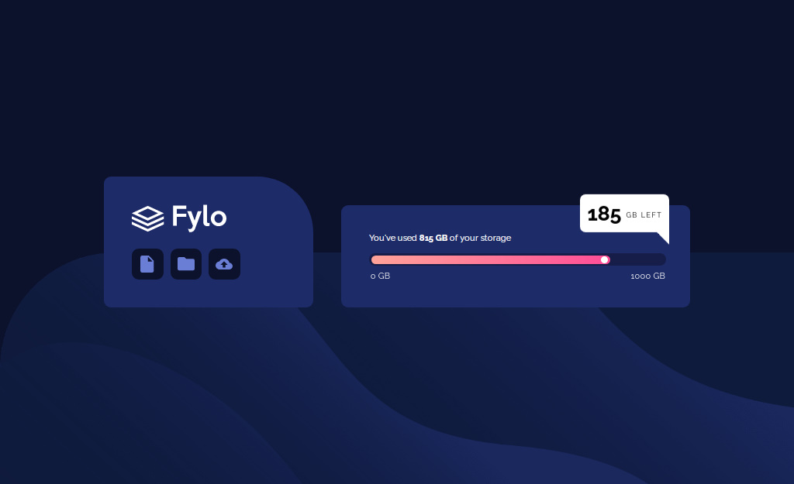

# Fylo Data Storage

<!--  -->

This Is The Preview To My <a href="https://abdoshbr3322.github.io/Fylo/">Page</a>   I Hope You Like It and This Is The Link To The 
<a href="https://github.com/abdoshbr3322/Fylo">Repository</a>

Then I Have Gained A Little Skills That I Didn't Have It   So I'm Very Greatfull !
- Make Reponseive Page With The Powerfull Of **Grid** 
- Get The Information From The Style Guid
- Use The Animation Shorthand 
- And Finally Is That <a href="https://www.frontendmentor.io/">Fron-End-Mentor</a> is An Amzing WebSite 

This Is The **Challenge** Design
------------

And This Is My **Solution**
------------

