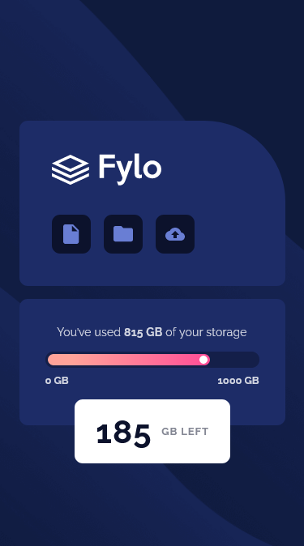
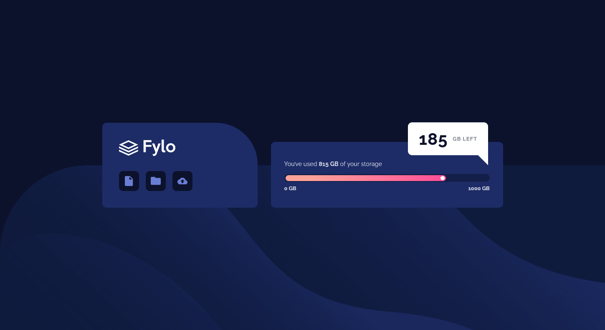

# Frontend Mentor - Fylo data storage component solution

This is a solution to the [Fylo data storage component challenge on Frontend Mentor](https://www.frontendmentor.io/challenges/fylo-data-storage-component-1dZPRbV5n). Frontend Mentor challenges help you improve your coding skills by building realistic projects. 

## Table of contents

- [Overview](#overview)
  - [The challenge](#the-challenge)
  - [Screenshot](#screenshot)
  - [Links](#links)
- [My process](#my-process)
  - [Built with](#built-with)
  - [What I learned](#what-i-learned)
  - [Continued development](#continued-development)
  - [Useful resources](#useful-resources)
- [Author](#author)

## Overview

### The challenge

Users should be able to:

- View the optimal layout for the site depending on their device's screen size

### Screenshot




### Links

[live site URL](https://fylo-data-storage-component-kas.netlify.app/)

## My process

### Built with

- Semantic HTML5 markup
- CSS custom properties
- Flexbox
- Mobile-first workflow

### What I learned

*Using HSL differently in custom properties*

I used this challenge to experiment with something cool I've seen the other day (link to Kevin Powell's video in Useful resources). I tend to start  my projects by declaring custom properties at the top like this:


````
:root {
--clr-drk-blue-600: hsl(228, 56%, 26%);
--clr-drk-blue-900: hsl(229, 57%, 11%);
}

````

And then I refer to these HSL values as custom properties later. This doesn't leave much room for creativity however, and as soon as you want to change lightness, opacity, etc, these custom properties become useless. So following this awesome video, this time I declared these properties a bit differently:

````

:root {
--clr-drk-blue-600: 228, 56%, 26%;
--clr-drk-blue-900: 229, 57%, 11%;
}

````

Just omitting hsl() from them allowed me to manipulate them to my liking:

````

.progress-bar {
  background: hsl(var(--clr-drk-blue-900), .5);
}

````

Not a huge deal, but since I face this problem kind of frequently, I'm going to get into the habit of doing this in future projects. ^^

### Continued development


### Useful resources

- [CSS Gradient generator](https://cssgradient.io/)
- [Kevin Powell's video on custom properties and HSL](https://www.youtube.com/watch?v=IHaT_rjC2gM) - A great video on a new way of using custom properties and HSL
- [Wev Dev Simplidied on CSS animations](https://www.youtube.com/watch?v=YszONjKpgg4)

## Author

- Frontend Mentor - [@FluffyKas](https://www.frontendmentor.io/profile/FluffyKas)


